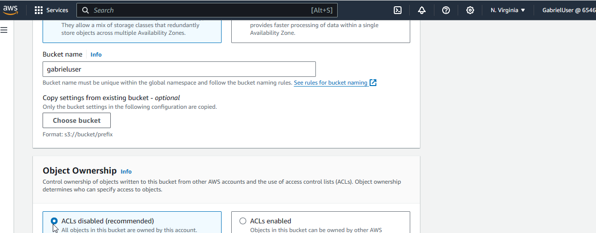
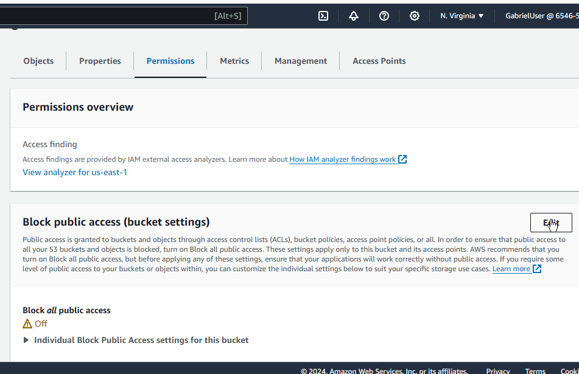

# How to Deploy Website Using s3 and CloudFront

#### BUCKET CREATION
1. Login into your AWS account
2. On your AWS Management Console, search for S3.

 

3. Click on Create a Bucket

 
 
4. Create a bucket with the following configuration:

 ● Name: has to be globally unique

 ● AWS Region: us-east-1
 
 ● Disable ACL

 

 ● Uncheck the Block all public access box

 
 ● Check the box that acknowledges that you understand the current settings might result in this bucket and all the objects within becoming public

  

● Leave everything else as their default configuration.
● Click on Create Bucket.

#### ENABLING STATIC WEBSITE HOSTING

5. Click on the newly-created bucket, and go to the Properties tab.

6. Scroll down to the end to Static Website Hosting
7. Click on the edit button
8. Check the Enable radio button. After this, a list of configurations for the static website hosting will appear. Follow the instructions below:

● Hosting Type: Host a static website

● Index document: type index.html

● Click on Save Changes

#### CONFIGURE BUCKET POLICY TO ALLOW PUBLIC ACCESS

 9. Go to the Permissions tab of your bucket.

  

 10. Scroll down to Bucket Policy, and click on edit

  

There are 2 ways to add a bucket policy:

- Checking Policy examples and copying the ones for your use case.

- Using a Policy generator.
- We’ll be using the second method for this project.
 11. Click on Policy Generator.

  

 12. You will be redirected to the AWS Policy Generator Page. Fill out the fields using the following configuration:

 
~~~ 
Policy Type: S3 Bucket Policy
Effect: Allow
Principal: *
AWS Service: Amazon S3
Actions: Check the GetObjects checkbox
ARN: Paste the ARN for your S3 bucket here, and then add '/*'.
~~~

Here’s an example of how it should look like:

arn:aws:s3:::<"bucket-name">/*

**Replace <"bucket-name"> with the name of your bucket.

 13. Click on Add Statement > Generate Policy.
 

 14. Copy the S3 Bucket Policy that has been generated and paste it in the Bucket Policy under the Permissions tab of your bucket.

 15. Click on Save Changes.

#### UPLOAD FILES INTO BUCKET

 16. Under the Objects tab of your bucket, click on ‘Upload’  

17. Upload the following files to your bucket:
- index.html
- Cloud Club Logo
The files can be found using this link.
18. After successfully uploading the files, go to the Properties tab of
your bucket.

Scroll down to Static website hosting. You will find the URL of your website there.

  
Click on the URL to see the uploaded website displayed.

 

#### CREATING A CLOUDFRONT DISTRIBUTION

Here, you will create a CloudFront distribution to serve the contents
of your website. This will help to reduce latency and also reduce
continuous calls to your S3 Bucket.

19. Search for CloudFront in the search bar.

20. Click on Create Distribution

21. Configure the distribution with the following properties:

- Origin domain: Select your S3 bucket endpoint
- Origin path:
- Name: Use the S3 bucket endpoint

- Origin access: Check the Origin access control
settings(recommended) option

Origin access control: Click on Create control settings
- Name: Use the S3 bucket endpoint
- Description:
- Signing behavior: Check the Sign requests(recommended)
option
- Origin type: S3
Click on Create

Under Web Application Firewall, Check the Do not enable security
protections option.

 

Default root object: index.html
Click on Create distribution

#### UPDATING S3 POLICY FOR CLOUDFRONT
To complete the CloudFront Distribution Configuration, we will need
to update our S3 Policy statement to allow read access to CloudFront
origin access control and we will also block all public access to the S3
bucket.

22. After creating the CloudFront distribution, you will be prompted to
copy and update your S3 Policy statement to allow read access to
CloudFront origin access control.

 

23. Return to your S3 bucket. Under the Permissions tab, Click on the
Edit button of Block public access (bucket settings)

24. Check Block all public access checkbox.
25. Click on Save changes

26. Still under the Permissions tab, Click on the Edit button of
Bucket policy

 

27. Under Policy, delete the previous policy and paste the policy
copied from CloudFront after creating the distribution.

28. Click on Save changes.

 

Now, if you try to access your website using the URL of your S3
bucket, you will get a 403 error. This is because we have blocked all
public access to it.

To view your website, you must use your CloudFront distribution's
URL.

29. Go back to the CloudFront console. Click on the CloudFront
distribution you just created. Under General > Details, you will find
the Distribution domain name.

 Click on it to copy it. Paste it in your
browser. You should see the webpage now

 

#### TIME TO LIVE(TTL)
CloudFront uses caching and Edge locations to serve content to
customers faster. CloudFront uses TTL to control how long content is
cached. For example, a TTL of 3600 seconds would indicate the
content should be cached for 1 hour before revalidating. Shorter TTLs
make content expire faster. After the end of the set TTL, CloudFront
will request new content from your S3 bucket and cache it again. It
repeats this cycle continuously to serve customers around the world
faster.

30. In the CloudFront console, click on the distribution for this project.
Navigate to the Behavior tab.

31. Select the Behavior listed there, and click on Edit

 

32. Under Cache key and origin requests, check the Legacy cache
settings button.

33. Under Object caching, check the Customize button.
34. Change the Default TTL to 180.

 

35. Click on Save changes.
36. To demonstrate caching, we will need to make a slight change to
our index.html file. Using your favorite code editor (such as VSCode,
Notepad++, Atom, etc.) make a few changes to the index.html. You
can add a new 
 tag with a new sentence. Save this file and
upload it to your current S3 bucket.

37. Add the new index.html file and click on Upload. Note that you do
not need to delete the previous index.html file, as the new one will
replace it.

38. Reload the page displaying the URL of your CloudFront
distribution. You will notice that the new changes are not displaying.
To see the new changes, you will have to wait for 180 seconds

#### CACHE INVALIDATION
In a situation where you want the new changes to your website to be
displayed before the end of the set TTL, you can invalidate the cache
so that it goes to the source S3 bucket and grabs whatever new
content is there.
You can invalidate the whole content of the S3 bucket or specific
objects in the bucket.

39. Increase the TTL of the CloudFront distribution. Repeat steps 30 -
35, but this time, set the TTL to 600 seconds.
40. In the CloudFront console, click on the distribution for this project.
Navigate to the Invalidations tab. Click on Create invalidation.

41. Under object paths, add the following line:

The wildcard (*) means that CloudFront will invalidate all the contents
of your S3 bucket. You can experiment with specific paths for images
if you want.
Click on Create invalidation.

42. To demonstrate cache invalidation, edit the content of your
index.html file by following steps 36 - 37.

43. Reload the page displaying the URL of your CloudFront
distribution. You will notice that the new changes are immediately
displayed. This means that the invalidation is working.

#### DELETING AND CLEANING UP
In this tutorial, you have learned how to create an AWS S3 bucket, a
CloudFront distribution, and cache invalidation. You’ll have 1 week to
complete the project and submit it. Once the project has been
graded, you will need to delete the resources used in order not to
incur charges from AWS.

44. Delete the CloudFront distribution by selecting the distribution and
clicking on Disable.

After disabling the distribution, you might need to wait a few seconds
to minutes before you can delete it. Repeat this step, but this time,
click on Delete.

45. To delete the S3 bucket, go to the S3 console, and select the
bucket. Then click on Empty. Follow the instructions to empty and
then delete the bucket.

### Thank you so much for taking the time to review my project! Your interest and feedback mean a lot to me on linkedin. [GABRIEL AKINTADE ](https://www.linkedin.com/in/gabriel-akintade-24441b153/)

